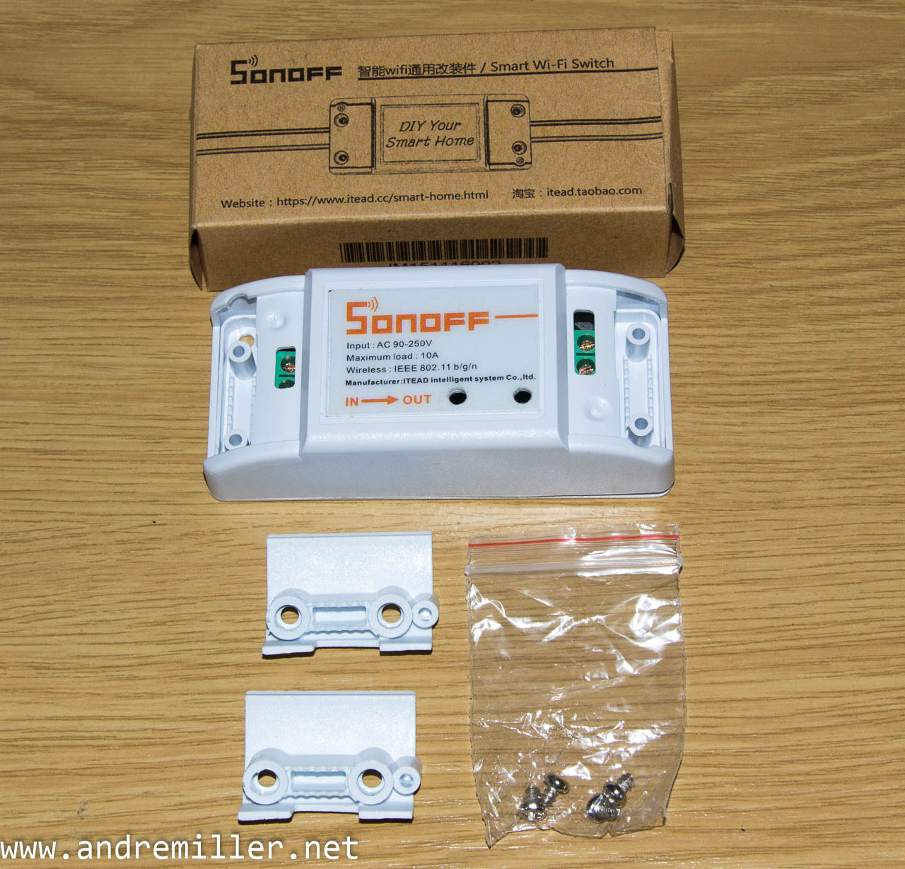
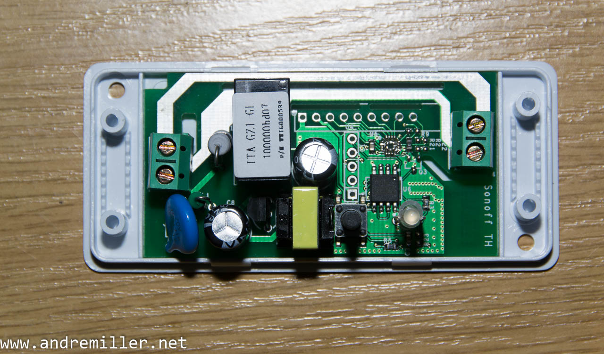
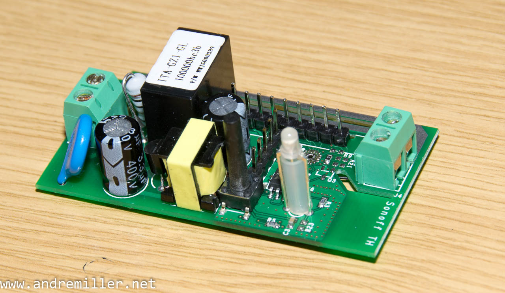
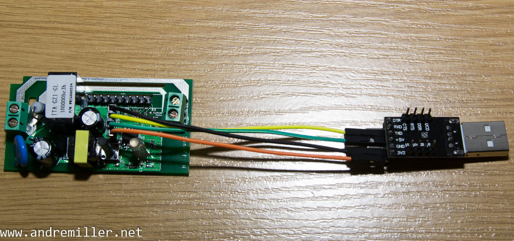

I purchased some of these wireless smart switches from ITEAD, but didn’t
like that you had to use their app and cloud server to use them. They
use an ESP8266 microprocessor, so I wanted to see if I could re-program
it to load my own firmware.

NOTE: Someone asked me if I have the original firmware dump for the for
this device, unfortunately I do not. If you flash your own firmware onto
this device, you do so at your own risk.

UPDATE 2016-09-07: There is a related post on [How to upgrade the Sonoff
flash memory from 1MB to
4MB](link://slug/upgrading-sonoff-wireless-smart-switch-flash-memory-esp8266).

This is what you get in the box:

And opening up the case, you find two sets of unsoldered pins, the
horizontal ones is used for a 433Mhz RF module, which I did not
purchase. The vertical one brings out the RX and TX pins of the ESP8266
along with 3.3V, GND and a GPIO pin.

I soldered on two pin headers, but the top vertical is not required to
re-program it.

Then, you can hook it up to a USB to serial adapter.

In this orientation, the bottom pin is pin 1, and the connections are
made as follows:

| Sonoff J1   | Wire          | USB To Serial |
|-------------|---------------|---------------|
| 1 : VCC-3V3 | Orange        | 3V3           |
| 2 : E-RX    | Green         | TXD           |
| 3 : E-TX    | Yellow        | RXD           |
| 4 : GND     | Black         | GND           |
| 5 : GPIO14  | Not Connected | Not Connected |

To place an ESP8266 into program mode, GPIO0 must be LOW during power
up. The schematic shows that GPIO0 is pulled HIGH with a resistor and
that the switch (S1) is connected between GND and the same resistor.

[Download Sonoff Smart Switch
Schematic](/files/programming-an-itead-sonoff-wireless-smart-switch-esp8266/Sonoff_schmatic.pdf)

By holding in the tactile switch that is used to turn the lamp on/off
before powering on the device, you can place the ESP8266 into
programming mode.

# The steps to program the device

1.  Disconnect the AC power, power it only from the USB to Serial for
    safety
2.  Hook up the USB to Serial as shown above
3.  Hold down the switch
4.  While holding down the switch, plug the USB to Serial into your PC
5.  Let go of the switch
6.  Use the Arduino IDE to select the correct USB port and upload your
    program.

# ESP8266 pin usage

| ESP8266 Pin | Function | GPIO   | Connected to                                |
|-------------|----------|--------|---------------------------------------------|
| 9 – MTMS    | GPIO     | GPIO14 | J1 Pin 5                                    |
| 10 – MTDI   | GPIO     | GPIO12 | Relay (HIGH to turn on)                     |
| 12 – MTCK   | GPIO     | GPIO13 | LED (LOW to turn on)                        |
| 15 – GPIO0  | Flash    | GPIO0  | Tactile switch (LOW when switch is pressed) |
| 25 – RDX    | UART RXD | GPIO3  | J1 Pin 2                                    |
| 26 – TXD    | UART TXD | GPIO1  | J1 Pin 3                                    |

You can use the table above to determine which GPIO’s to use when
creating your own program to read the switch and to turn the relay
on/off.

GPIO14 is available on the J1 pin header, and you can also use the other
GPIO’s in the table above, although they’re a bit more tricky to use.

I’ve also managed to get the analog input pin to work (required some
fine soldering directly on the ESP8266)
