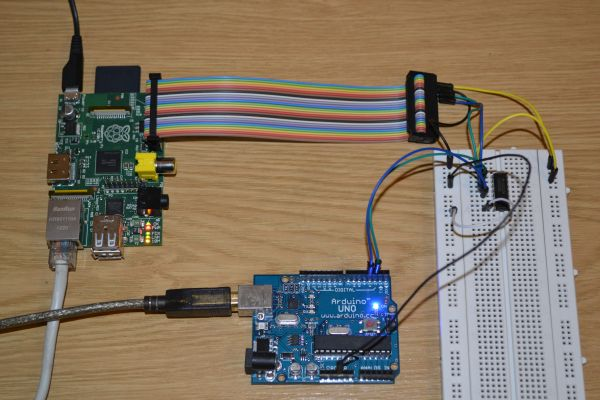
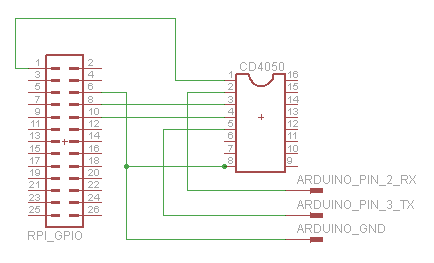
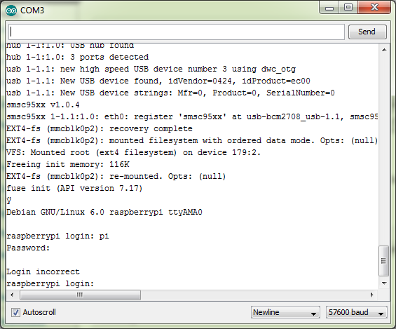

*NOTE:* This is an older post, and instead of using a CD4050 it might be easier to use a bi-directional level shifter module.

In an attempt to get my Raspberry Pi talking to my Arduino I’m exploring various different options. The first was to just use the USB connection, but that was too simple. So, here is how to connect the two using the UART on the GPIO pins of the Raspberry Pi.

To make testing easier I wanted to keep the Arduino’s serial connected via USB to my PC so I can print messages there and read it with the Serial Monitor. This meant using the SoftSerial library to implement a second serial port to talk to the Raspberry Pi. To protect my Raspberry Pi and to convert the 5V of the Arduino to 3.3V the Raspberry Pi needs I used a CD4050.



To show how this works the Arduino is running a small program that reads from the Raspberry Pi’s and copies this to my PC via USB.

By default the Raspberry Pi uses the UART in two ways:

1. Console Messages (including bootup messages)
2. A getty so you can login via serial

To use this serial port for your own uses you need to disable these two services. I decided to leave them enabled to test how well the serial connection works. However, the SoftSerial library on the Arduino doesn’t work so well at the default baudrate of 115200, so I changed this on the Raspberry Pi to 9600:

To change the console baudrate, edit /boot/cmdline.txt to look like this (this is all one line):

``` ansi
dwc_otg.lpm_enable=0 console=ttyAMA0,9600 kgdboc=ttyAMA0,9600 console=tty1 root=/dev/mmcblk0p2 rootfstype=ext4 rootwait
```

Also, edit /etc/inittab to change the baudrate of the getty (you should fine a line like this with the baudrate of 115200, change that number to 9600):

``` ansi
2:23:respawn:/sbin/getty -L ttyAMA0 9600 vt100
```

Ok, now upload the program to your Arduino:

``` c++
/*
 Connects Arduino to Raspberry Pi
 Arduino: SoftSerial
 Raspberry Pi: GPIO UART

 This is just a simple passthrough, based on Arduino SoftSerial example
 */
#include <SoftwareSerial.h>

SoftwareSerial mySerial(2, 3); // RX, TX

void setup()  
{
 // Open serial communications to PC and wait for port to open:
  Serial.begin(57600);
   while (!Serial) {
    ; // wait for serial port to connect. Needed for Leonardo only
  }

  Serial.println("Connected to PC");

  // set the data rate for the SoftwareSerial port to Raspberry Pi
  mySerial.begin(9600);
}

void loop() // run over and over
{
  // If data is available on Raspberry Pi, print it to PC
  if (mySerial.available())
    Serial.write(mySerial.read());
  // If data is available on PC, print it to Raspberry Pi
  if (Serial.available())
    mySerial.write(Serial.read());
}
```

Connect the Arduino to the Raspberry Pi:



Raspberry Pi Pins used: 
- 1 : 3.3V
- 6 : Ground
- 8 : UART TXD
- 10: UART RXD

CD4050 Pins used: 
- 1 : VDD (3.3V)
- 2 : Output A
- 3 : Input A
- 4 : Output B
- 5 : Input B
- 8 : VSS (Ground)

If you then open your Serial Monitor on you PC, and set the baudrate to 57600 you should get the following message:

``` ansi
Connected to PC
```

If you then reboot your Raspberry Pi, the console messages should be echoed back to the Serial Monitor running your PC and leave you with a login prompt from the getty:



If you change ‘No Line Ending’ to ‘Newline’ you can enter your username and are then prompted for a password. Unfortunately the password doesn’t work. I still need to figure out why it’s not accepting my password. I suspect it’s to do with a line termination character or something.
